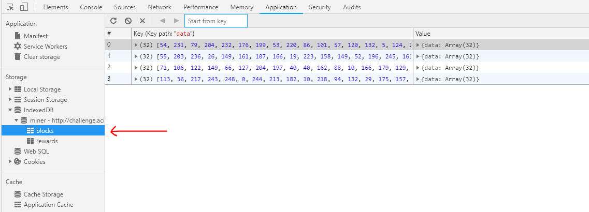
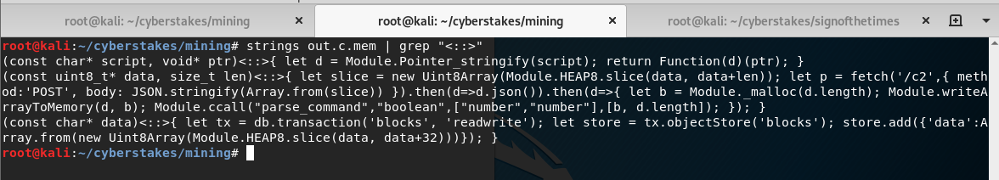
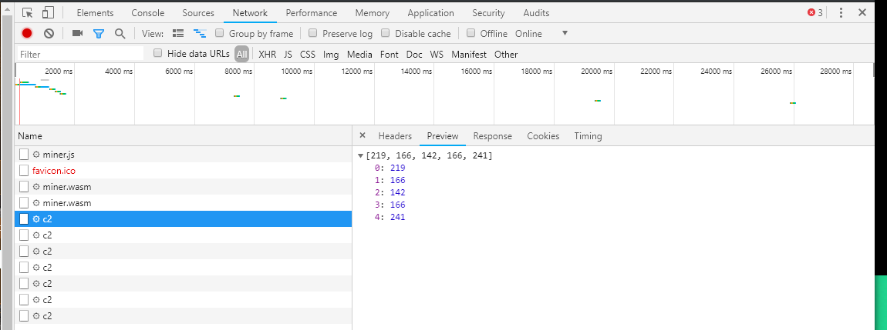
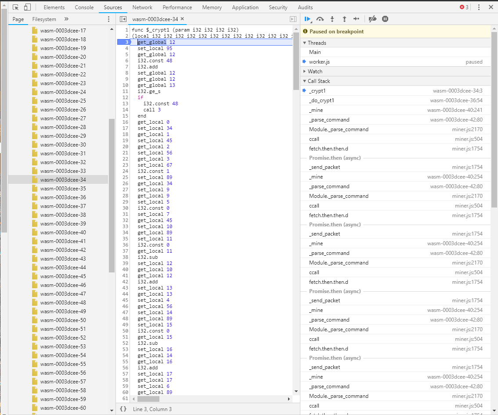
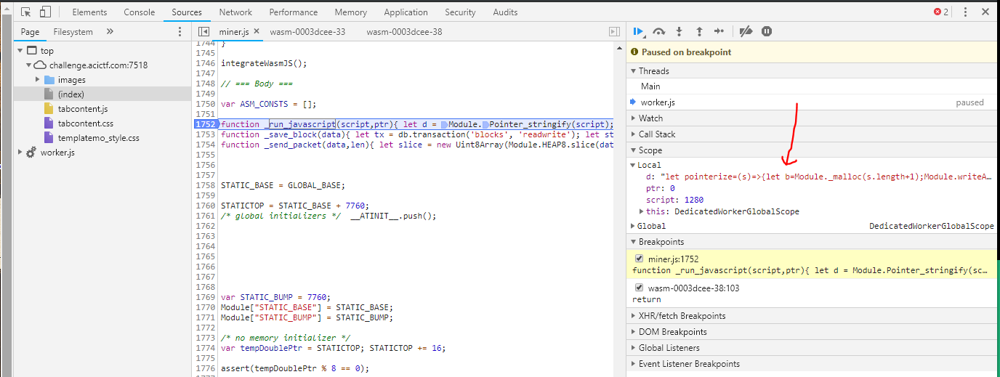
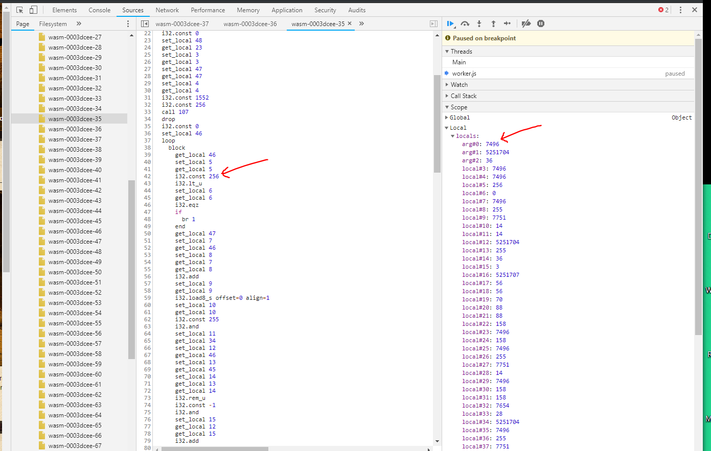
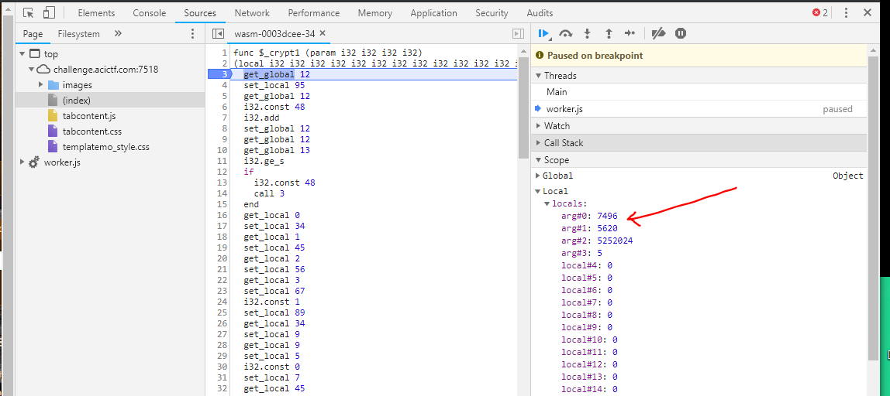
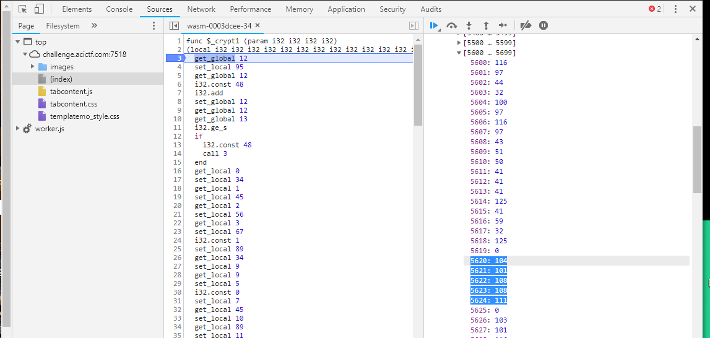
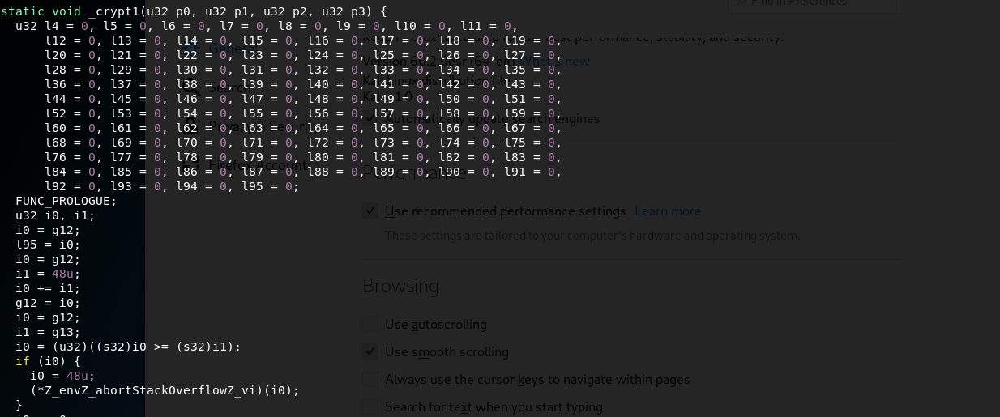

# CyberStakes Some Assembly Required Challenge

Walkthrough for the highest-point flag in CyberStakes 2018. This event was extremely well-run and educational. Thanks a ton to the organizers!

## Overview

This challenge was quite involved and required chaining together a few different steps. These were:

* Reversing the main miner <-> C2 communication encryption
* Discovering a SQL injection vulnerabilty in the C2 server
* Recovering the reward-generating JavaScript payload
* Overcoming JavaScript obfuscation and anti-debugging measures
* Bypassing another layer of encryption

## Getting Acquainted

At first glance, the target website appeared to be a static blog without much going on and no pages aside from the index. However, my computer's fan soon became much louder, prompting me to open Chrome's dev tools and look at what was going on. To my surpise, there was quite a bit of activity going on.

The first thing interesting thing that happened on page load was the spawning of a [Web Worker](https://developer.mozilla.org/en-US/docs/Web/API/Web_Workers_API/Using_web_workers). For those unfamiliar, a Web Worker is a modern web feature that allows for executing JavaScript in a separate thread from the main one. The [`worker.js`](./worker.js) script being run didn't do much besides set a few configuration variables and kick off execution of the `miner.js` script.

The [`miner.js`](./miner.js) script is a beast, but not too complex once you figure out what's going on. It is mainly boilerplate generated by the [Emscripten](https://developer.mozilla.org/en-US/docs/Mozilla/Projects/Emscripten) compiler, which is a powerful tool commonly used to compile C and C++ code into JavaScript to be run in the browser or other JavaScript runtimes like [Node.js](https://nodejs.org/en). However, in this case, it was paired with the equally powerful [`asm.js`](http://asmjs.org/) project to execute a WebAssembly file.

[WebAssembly](https://webassembly.org/) is another modern web feature that is an attempt to bring a computationally-efficient and portable JavaScript-alternative to browser runtimes. It is a stack-based opcode language that isn't too tough to grok if you read some of the great resources online, like [here](https://github.com/sunfishcode/wasm-reference-manual).

So what was this WebAssembly payload actually doing to my poor laptop fan? For starters, I noticed that two [IndexedDB](https://developer.mozilla.org/en-US/docs/Web/API/IndexedDB_API) tables were created in my browser's local storage. One was named `blocks` and the other was named `rewards`, as shown below.



As shown in the screenshot, this table was periodically filling up with data. The reference to blocks and rewards (in addition to one of the files being dubbed `miner.js`) gave me a feeling that I was likely dealing with some type of cryptocurrency-mining payload. My next step was to perform some static analysis on the WebAssembly binary to get a better understanding of the bulk of the payload. Fortunately, there are some great tools that exist to do such analysis. The one I went with was [WABT - The WebAssembly Binary Toolkit](https://github.com/WebAssembly/wabt). This collection of tools allows you to translate wasm binaries to C source code, which makes some of the analysis much easier.

After some poking around the C source, I felt like I had a better understanding of the important functions and where I should focus the efforts of my dynamic analysis in the Chrome debugger. Here are some of the key routines found in the binary:

* `_main` - The main entrypoint for execution flow.
* `_sha256_init` / `_sha256_transform` / `_sha256_init` - Core hashing functionality for the block mining.
* `_build_key` - A routine called only at the very beginning of program execution.
* `_do_crypt1` / `_crypt1` / `_crypt1_ks` - Functions related to some type of encryption / decryption. Of note is that this `crypt1` is the only layer of encryption applied to all received *and* sent messages. 
* `_unxor_script` - A routine which un-xors some portions of the wasm binary, meaning that there are probably some JavaScript snippets embedded within the binary.
* `_parse_command` - Essentially a big switch statement that parsed received messages from the C2 server. The 
* `_mine` / `_command_mine` - Routines for parsing of mining directives from the C2 server and discovering blocks.
* `_ask_for_work` - What the miner initially sends the C2 server to get a block to mine.

There are also three important functions implemented via JavaScript in `miner.js`: `_run_javascript`, `_save_block`, and `_send_packet`. These all do just what their names indicate. I was most intrigued by `_run_javascript`, as this paired with the `run <text>` command checked for in the `_parse_command` routine allows the C2 server to send and execute arbitrary JavaScript on a miner. Interestingly, these exported JavaScript snippets can also be extracted from the wasm binary's data segment, as shown below.



Finally, I also noticed a `_tcrypt` function was exported from the wasm binary (allowing it to be called from JavaScript code) but was never called anywhere within either the wasm binary or the `miner.js` script. I decided to hold off on exploring this for the time being to focus on `crypt1`, but know that it will become an important piece later on.

## Reversing `crypt1`

Knowing that the mining client was both sending and receiving some type of encrypted / obfuscated payload to and from the C2 server, the first obvious step appeared to be reversing this communication stream. This would allow me to communicate directly with the server to both gather more information as well as poke around for vulnerabilities. There appeared to be a few steps involved in this encryption process:

* Load an initial key within the `_build_key` routine
* Further obfuscate this key via the `_crypt1_ks` routine
* Run the actual encryption routine using this obfuscated key, done in the `_crypt1` routine

I was able to determine this chain events from some analysis of the first message that the miner sends to the C2 server which, when decrypted, is the plaintext string `hello`. This ended up being something very important to find, as the address in memory of the `hello` string was statically defined to `5620`, meaning that I knew the memory location of a string that would always be sent to the C2 server on program startup. This meant that I could pause execution, overwrite this address with a string of my choosing, and resume execution to send any encrypted message I wanted to the C2 server. While I could have used this mechanism to completely bypass the reversal of `crypt1`, it was a fairly timely process. If I was going to be searching for vulnerabilities in the C2 server, I would need something quick and dirty like a Python script (which would require actually reversing the encryption). However, this overwrite at memory location `5620` will be an important piece later on. This is will be an important piece later on. The encrypted `hello` message being sent is shown in the below screenshot on Chrome's networking tools.



Further examination of the call stack during other chains of events in the program's execution confirmed that `_crypt1` is the driver behind all encryption and decryption of communication with the C2 server. An example of the call stack for the block-mining flow of function calls is shown towards the right of the below screenshot.



Working backwards from the first `hello` message being sent over the wire, I could know understand how the encryption key was generated. First, two JavaScript snippets are extracted from the wasm binary by un-xoring their contents. These scripts write two pieces of information to memory, which are concatenated to form this first-level key. The first snippet pulls the port number from the URL:

```javascript
let pointerize=(s)=>{let b=Module._malloc(s.length+1);Module.writeAsciiToMemory(s,b);return b};return pointerize(location.port);
```

The second snippet uses the `deploy_key` variable defined within `worker.js`:

```javascript
let pointerize=(s)=>{let b=Module._malloc(s.length+1);Module.writeAsciiToMemory(s,b);return b};return pointerize(deploy_key);
```

These snippets could be pulled from memory by setting a breakpoint within the `_run_javascript` function, as shown below.



So, our first-level key is `75182d613b486cbb9a01c37498676f325759`. Unfortunately, there is yet another step to be performed before this key can be used to encrypt / decrypt messages. This next step comes in the form of the `_crypt1_ks` routine. While I never bothered to fully understand the internals of this routine, I was able to gather that it essentially extends our first-level key to a lenght of 256 bytes and leaves it memory to be used by the core `_crypt1` routine later on. In the below screenshot, I've highlighted the indication of the 256-byte length as well as the first argument, which is where the resulting second-level key will be written to in memory.



Now with that part figured out, I could determine what arguments are passed to `_crypt1`. Below is an example from stepping through the encryption of `hello`.



The first argument, as we just touched on, is the starting location in memory of the 256-byte second-level key. The second argument is the starting address of the plaintext to be encrypted (remember that `hello` is statically defined at memory location `5620`). The third argument is the starting address of where the resultant encrypted message will be written to. The final and fourth argument is the length of the message. Of note is that encrypted and plaintext messages were always the same length, which makes verification a little bit easier. We can confirm that the `crypt1` function is acting on the plaintext `hello` as we expected by inspecting the memory locations in the debugger. I've highlighted `hello` in memory in the below screenshot. 



Of note is that I was able to pull the full 256-byte second-level from memory. Because this is based on the static port number and deploy key, it is always the same and can be used in my reversal of the encryption logic. I now had enough information to try my hand at reversing the core `_crypt1` routine. The first step  was to examine its C source (some of which is shown below). 



So, all of the parameters and local variables are not helpfully named. I realized that reversing this by translating its logic by hand was probably beyond my ability to do in a timely fashion, so I turned to alternative methods. I realized that since I knew that `_crypt1` was a pure function (i.e., its output relies solely on the parameters passed to it and not on any other system state), I could "cheat" a little bit by shimming the WebAssembly linear memory within a Python script and allow the routine (mainly unchanged) to act on that shimmed memory instead. Using this method, all I had to do was make a few syntactic changes to the disassembled C code and replace the WebAssembly memory loading and storing instructions with reads and writes to my shimmed memory object (which was just a Python list of integers). The resultant reversal of this encryption was a simple command-line Python application, found in the [`crypt1_reversed.py`](./crypt1_reversed.py) file in this repository.

## Talking with the C2 Server

Great. So now that we can talk freely with the C2 server, the flag should be just around the corner (ha!).

TODO

## JavaScript De-obfuscation

TODO

## Rewards

TODO

This is simply the ASCII flag: `ACI{f15a13ed9d6cae2acc66a217ccc}`. Too easy.
